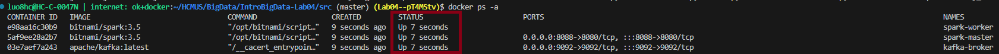

# Lab 04: Spark Streaming

## Prerequisites
- Docker 26.1.1 (or higher)
- Python 3.x

## How-to guide
### 1. Install requirements
- Install python packages:
```bash
cd src
pip install -r requirements.txt
```
### 2. Apache Kafka and Apache Spark setup
- We use [Apache Kafka Docker image](https://hub.docker.com/r/apache/kafka/) and [Apache Spark Docker image](https://hub.docker.com/r/bitnami/spark)

- To start the containers, we run:
```bash
docker-compose up -d
```

- The script will create 3 containers: **kafka-broker**, **spark-master** and **spark-worker**. Then, we can check if these containers running successfully or not by running:
```bash
docker ps -a
```



- Next, we open a new terminal and run bat script below to create Kafka topics, including **btc-price**, **btc-price-moving** and **btc-price-zscore**:
```bash
.\Extract\kafka_setup.bat
```

## Steps 
### 1. Extract
- Run `22127293.ipynb` to produces data into Kafka **btc-price** topic.
> Optional: To see how data is produced, you can go back to `kafka_setup.bat` terminal and run
```bash
./kafka-console-consumer.sh --bootstrap-server localhost:9092 --topic btc-price --from-beginning
```

### 2. Transform
- Write your code in `.\Transform\22127293_moving.py` and `.\Transform\22127293_moving.zscore`, save it and submit it to spark master container by running this command:
```bash
.\Transform\spark_submit.bat <your python file name> 
```

### 3. Load
- Write your code in `.\Load\22127293.py`, save it and submit it to spark master container by running this command:
```bash
.\Transform\spark_submit.bat 22127293.py
```
<p>&copy; 2025</p>